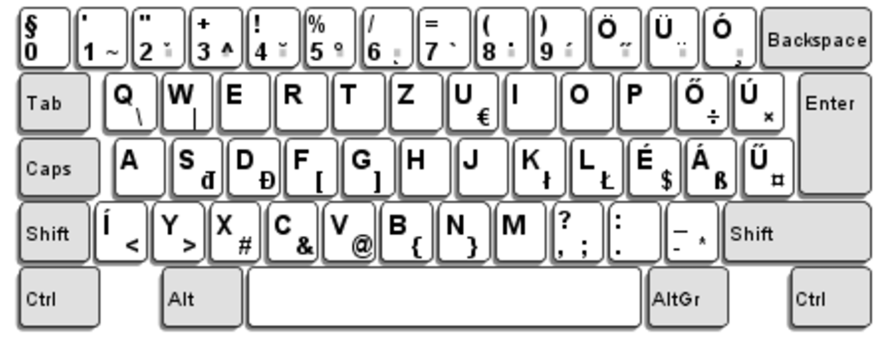

# Hungarian PC keyboard layout for Mac OSX

Created by Adam Kovesdi using Ukelele keyboard layout editor

## links

- http://scripts.sil.org/cms/scripts/page.php?site_id=nrsi&id=ukelele
- http://ascii-table.com/keyboard.php/208

## usage

Copy Hungarian-PC.icns Hungarian-PC.keylayout to "/Library/Keyboard Layouts"
